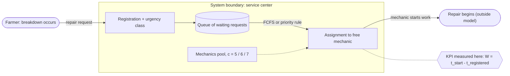

```mermaid
flowchart LR
    F(["Farmer: breakdown occurs"]) -->|"repair request"| R

    subgraph SYSTEM ["System boundary: service center"]
        R["Registration + urgency class"] --> Q[("Queue of waiting requests")]
        Q -->|"FCFS or priority rule"| A["Assignment to free mechanic"]
        M["Mechanics pool, c = 5 / 6 / 7"] -.-> A
    end

    A -->|"mechanic starts work"| OUT(["Repair begins (outside model)"])

    K1{{"KPI measured here: W = t_start - t_registered"}}
    A -.- K1
```
